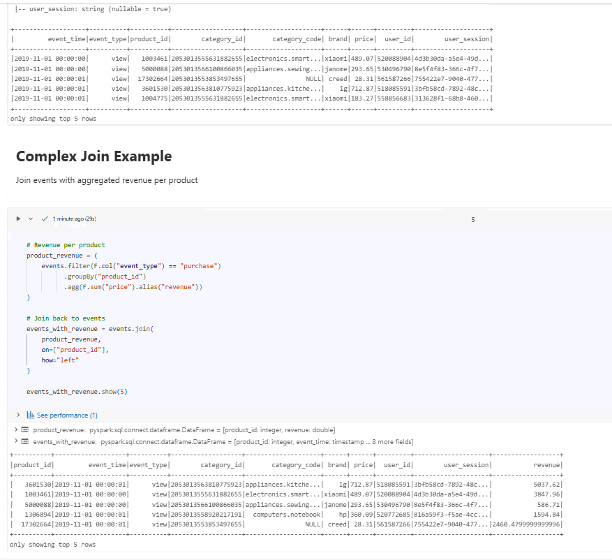
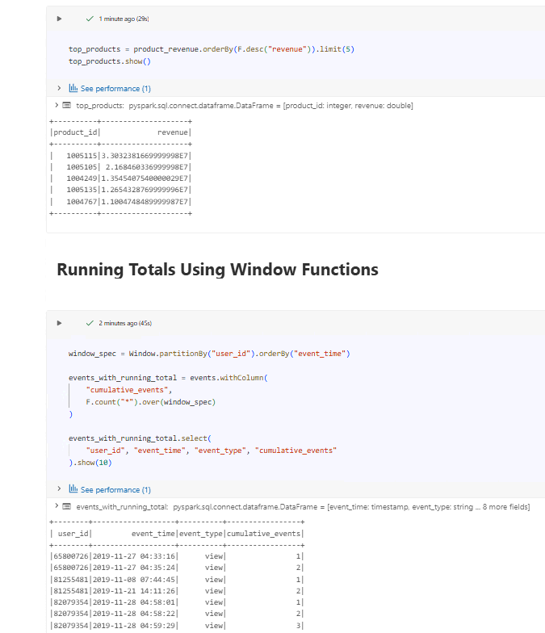
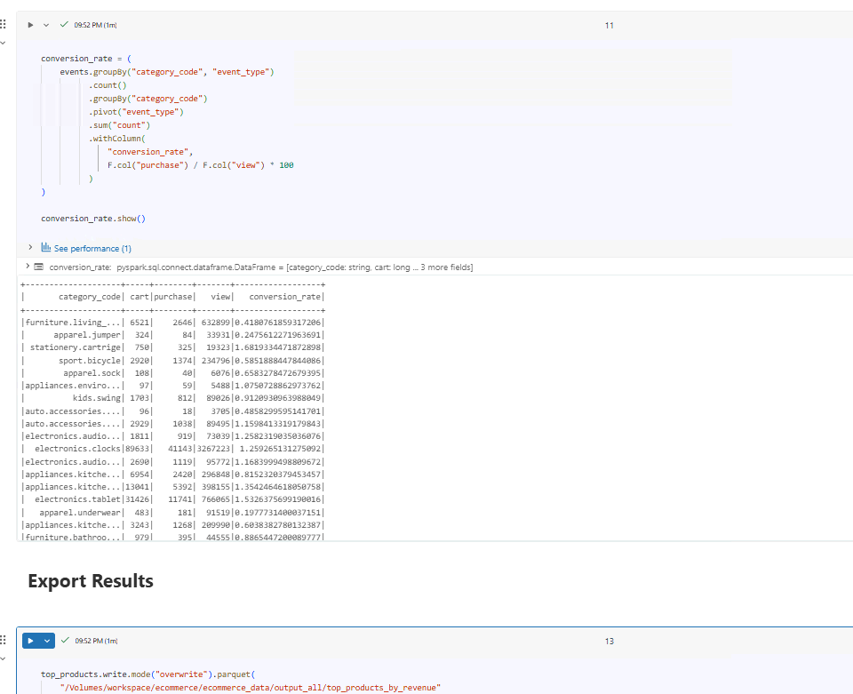
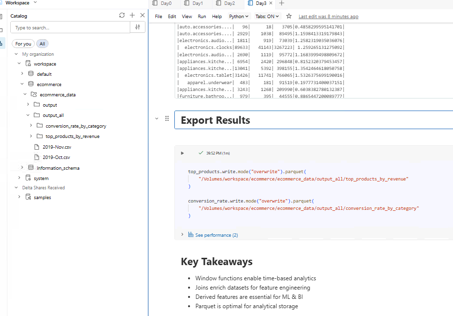

# Day 3 Completed — PySpark Transformations Deep Dive (Databricks 14 Days AI Challenge)

Today I practiced **core PySpark transformations** on an e-commerce events dataset in Databricks.

---

## 📌 Dataset Used
**File:** `2019-Oct.csv`   and `2019-Nov.csv`
**Columns:** `event_time, event_type, product_id, category_id, category_code, brand, price, user_id, user_session`

---

## 📘 What I Learned Today
- Difference between **PySpark vs Pandas** (distributed vs local)
- Basic **groupBy + aggregation** for analytics
- **Window functions** for running totals per user
- **Pivot** to reshape event counts (view vs purchase)
- Creating simple **derived features** like conversion rate

---

## 🛠️ Tasks I Completed
1. Loaded the October e-commerce dataset
2. Calculated **Top 5 products by revenue**
3. Created **running total (cumulative events) per user**
4. Calculated **conversion rate by category** (purchase ÷ view)

---

##  Practice Queries (Beginner Version)

### 1) Top 5 products by revenue


```python
from pyspark.sql import functions as F

revenue = (events
    .filter(F.col("event_type") == "purchase")
    .groupBy("product_id")
    .agg(F.sum("price").alias("revenue"))
    .orderBy(F.desc("revenue"))
    .limit(5)
)

display(revenue)
```

## Notebooks


## Screenshots








