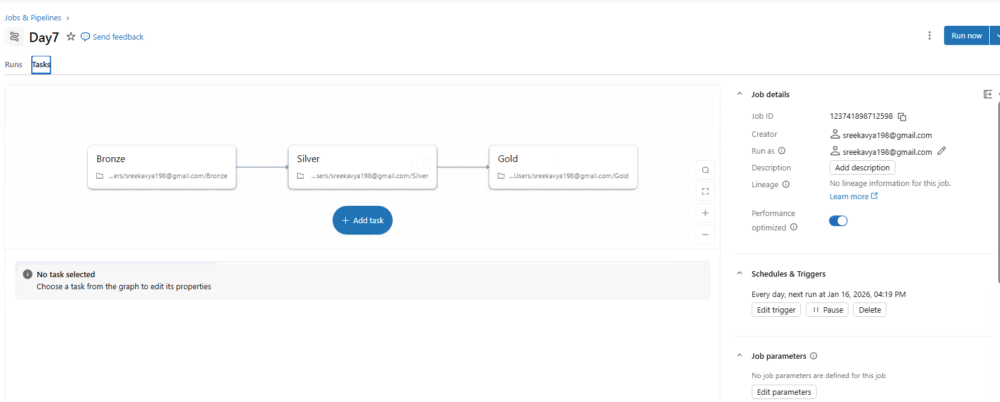
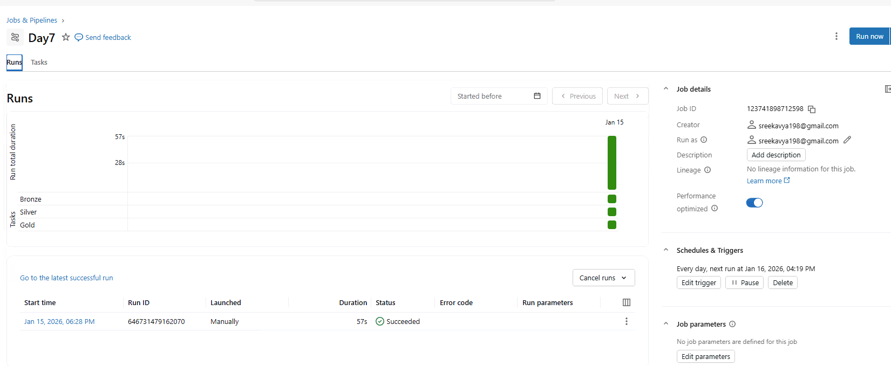

# Day 7 Completed – Workflows & Job Orchestration (Databricks 14 Days AI Challenge)

## 📘 What I Learned Today
- Databricks Jobs vs notebooks
- Multi-task workflows
- Parameters & scheduling
- Error handling

---

## 🛠️ Tasks I Completed
1. Add parameter widgets to notebooks
2. Create multi-task job (Bronze→Silver→Gold)
3. Set up dependencies
4. Schedule execution

---

## Screenshots

