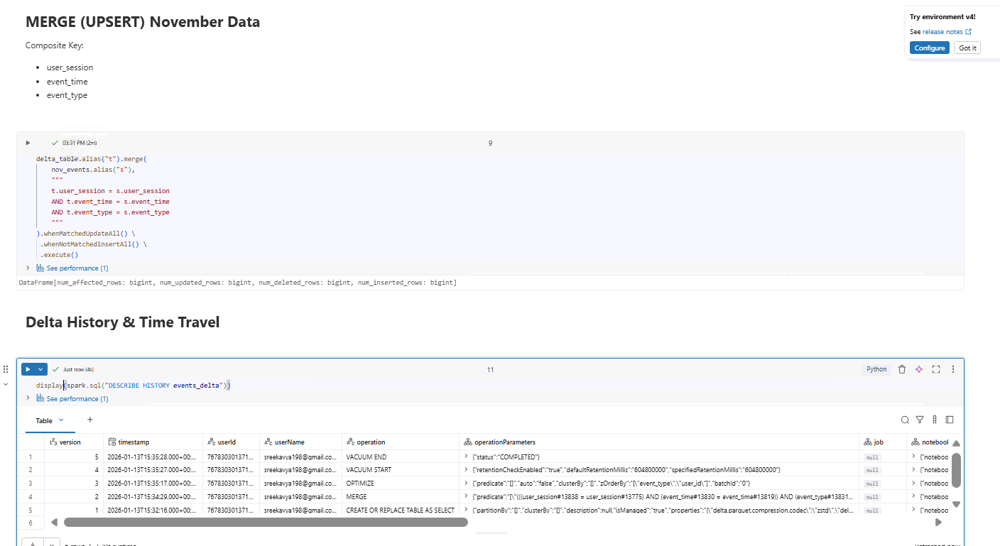

# Day 5 Completed – Delta Lake Advanced (Databricks 14 Days AI Challenge)

Today I practiced **Advanced Delta Table** on an e-commerce events dataset in Databricks.

---

## 📌 Dataset Used
**File:** `2019-Oct.csv` , `2019-Nov.csv`
**Columns:** `event_time, event_type, product_id, category_id, category_code, brand, price, user_id, user_session`

---

## 📘 What I Learned Today
- Time travel (version history)
- MERGE operations (upserts)
- OPTIMIZE & ZORDER
- VACUUM for cleanup

---

## 🛠️ Tasks I Completed
1. Implement incremental MERGE
2. Query historical versions
3. Optimize tables
4. Clean old files

---

##  Practice Queries (Beginner Version)

from delta.tables import DeltaTable

#### MERGE for incremental updates
deltaTable = DeltaTable.forPath(spark, "/delta/events")
updates = spark.read.csv("/path/to/new_data.csv", header=True, inferSchema=True)

deltaTable.alias("t").merge(
    updates.alias("s"),
    "t.user_session = s.user_session AND t.event_time = s.event_time"
).whenMatchedUpdateAll() \
 .whenNotMatchedInsertAll() \
 .execute()

#### Time travel
v0 = spark.read.format("delta").option("versionAsOf", 0).load("/delta/events")
yesterday = spark.read.format("delta") \
    .option("timestampAsOf", "2024-01-01").load("/delta/events")

#### Optimize
spark.sql("OPTIMIZE events_table ZORDER BY (event_type, user_id)")
spark.sql("VACUUM events_table RETAIN 168 HOURS")

## Notebooks

## Screenshots

