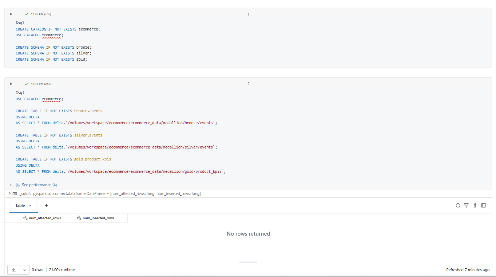
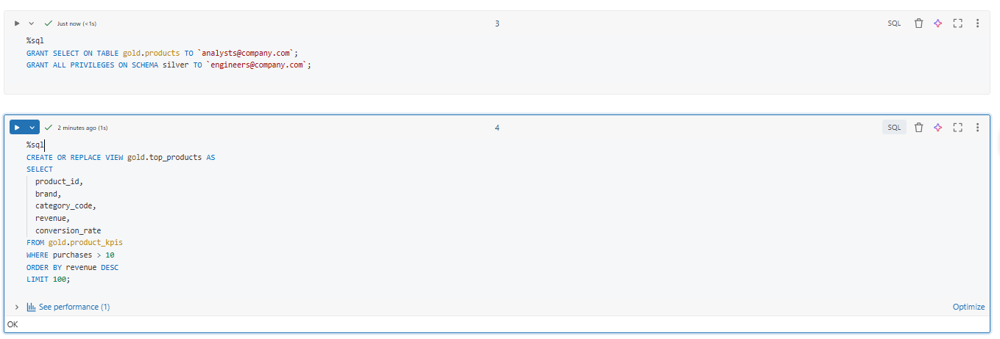
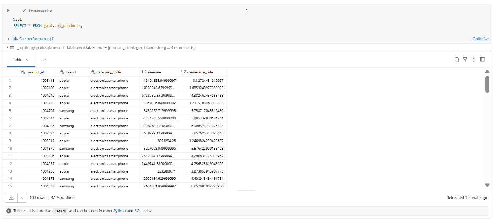

# Day 8 Completed — Unity Catalog (Catalog → Schema → Table), Permissions, Lineage, Managed vs External

Today I practiced **Unity Catalog basics** in Databricks:
creating a Catalog/Schema structure, registering Delta tables, granting permissions, checking lineage, and creating views for controlled access.

---

## 📘 What I Learned Today
- Unity Catalog hierarchy: **Catalog → Schema → Table/View**
- **Managed vs External tables**
  - Managed: Databricks manages the storage location
  - External: table points to an existing storage `LOCATION`
- Basic access control using **GRANT / REVOKE**
- How to check **data lineage** in Data Explorer
- Using **Views** for controlled access to data

---

## 🛠️ Tasks I Completed
1. Created catalog & schemas (bronze/silver/gold)
2. Registered Delta tables using LOCATION
3. Set up permissions (GRANT)
4. Created a view for controlled access

---

## Screenshots

