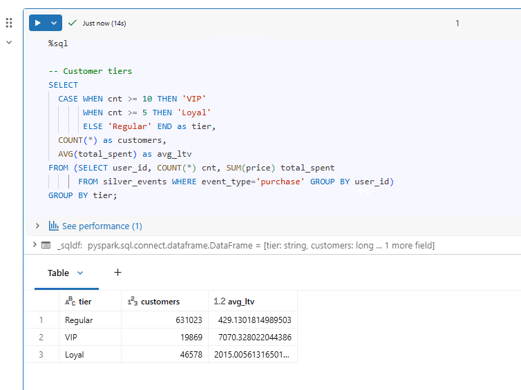

# Day 9 Completed — Databricks SQL Warehouses & Dashboards (Analytics + Visuals)

Today I practiced using **Databricks SQL**: creating a SQL Warehouse, writing analytical SQL queries, and building a simple dashboard with filters and scheduled refresh.

---

## 📘 What I Learned Today
- What a **SQL Warehouse** is (compute for running SQL queries / dashboards)
- Writing **analytical SQL** (CTEs, window functions, aggregations)
- Creating **visualizations** from SQL query results
- Building a **dashboard** (multiple charts + filters)
- Scheduling **auto-refresh**

---

## 🛠️ Tasks I Completed
1. Created a SQL Warehouse
2. Wrote analytical queries for trends, funnels, and customer tiers
3. Built a dashboard: **revenue trends**, **conversion funnel**, **top products**
4. Added filters and scheduled refresh

---

## ✅ SQL Warehouse (UI Steps)
1. Go to **SQL** → **SQL Warehouses**
2. Click **Create warehouse**
3. Choose a size (small is fine for learning)
4. Start the warehouse and run queries from the SQL editor

---
## Screenshots

