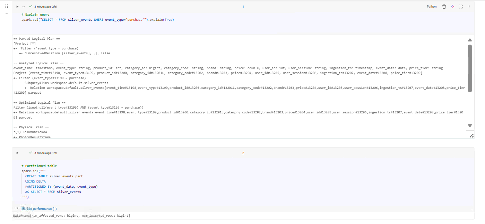
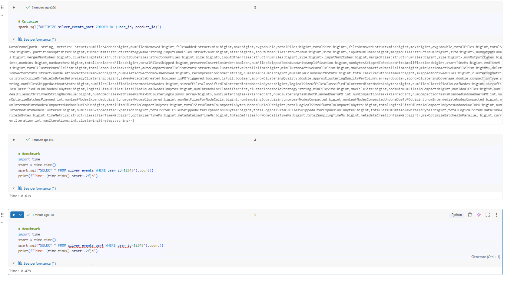

# Day 10 Completed — Performance Tuning (Explain Plans, Partitioning, ZORDER, Caching)

Today I practiced **basic performance tuning** in Databricks using:
query execution plans, partitioning, OPTIMIZE + ZORDER, and caching.  
Goal: understand *why* queries are slow and how to make them faster.

---

## 📘 What I Learned Today
- How to read query plans using **EXPLAIN**
- When partitioning helps (filters on partition columns)
- How **OPTIMIZE** compacts small files and improves scan performance
- How **ZORDER** clusters data to speed up selective queries
- When to use **CACHE** for repeated / iterative analysis
- How to do simple **benchmarks** (before vs after)

---

## 🛠️ Tasks I Completed
1. Analyzed query plans
2. Created a partitioned Delta table
3. Applied OPTIMIZE + ZORDER
4. Benchmarked query speed before/after and used caching

---

## Notebooks

## Screenshots

