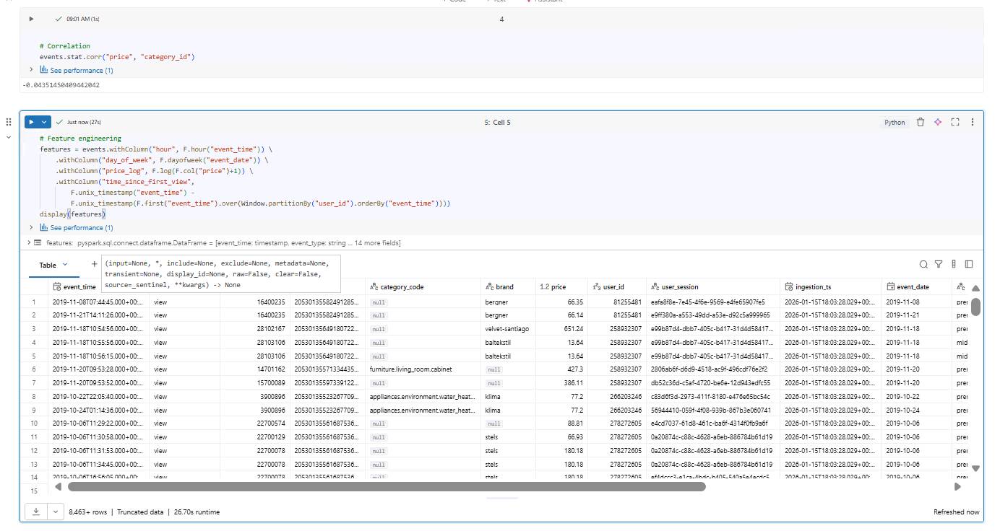

# Day 11 Completed — Statistical Analysis & ML Prep

Today I practiced **statistical Analysis & ML Prep** in Databricks using:

---

## 📘 What I Learned Today
- Descriptive statistics
- Hypothesis testing
- A/B test design
- Feature engineering

---

## 🛠️ Tasks I Completed
1. Calculate statistical summaries
2. Test hypotheses (weekday vs weekend)
3. Identify correlations
4. Engineer features for ML

---

## Notebooks

## Screenshots

