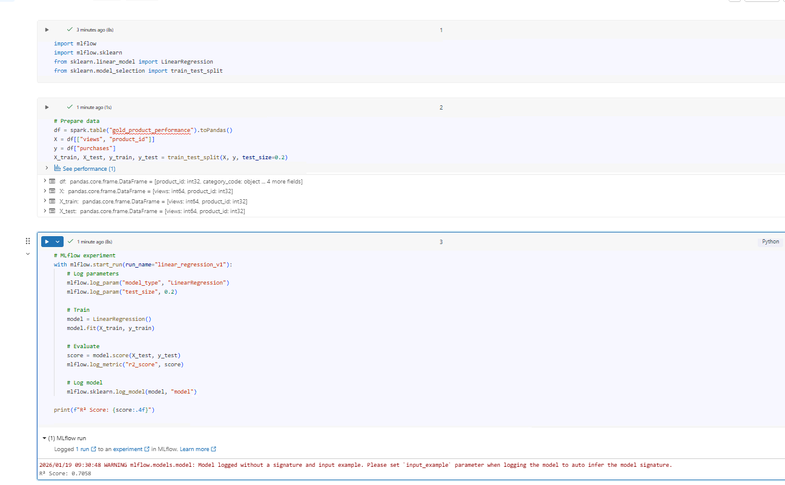

# Day 11 Completed — MLflow Basics

Today I practiced **MLflow Basics** in Databricks:

---

## 📘 What I Learned Today
- MLflow components (tracking, registry, models)
- Experiment tracking
- Model logging
- MLflow UI

---

## 🛠️ Tasks I Completed
1. Train simple regression model
2. Log parameters, metrics, model
3. View in MLflow UI
4. Compare runs

---

## Notebooks

## Screenshots

