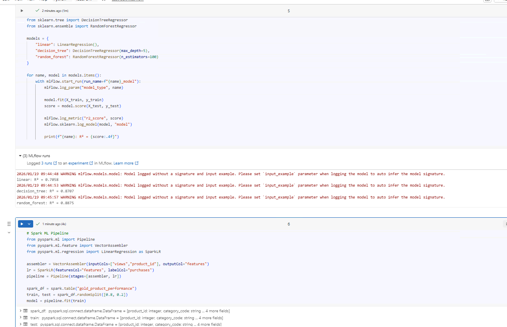

# Day 13 Completed — Model Comparison & Feature Engineering

Today I practiced **Model Comparison & Feature Engineering** in Databricks:

---

## 📘 What I Learned Today
- Training multiple models
- Hyperparameter tuning
- Feature importance
- Spark ML Pipelines

---

## 🛠️ Tasks I Completed
1. Train 3 different models
2. Compare metrics in MLflow
3. Build Spark ML pipeline
4. Select best model

---

## Notebooks

## Screenshots

