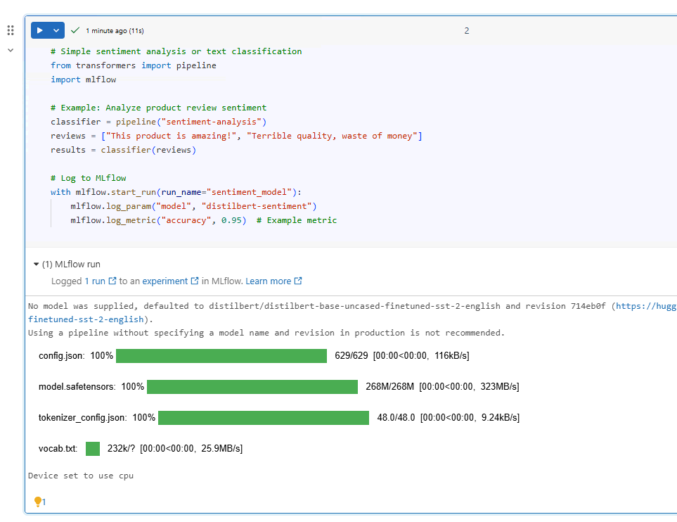

# Day 14 Completed — AI-Powered Analytics: Genie & Mosaic AI

Today I practiced **AI-Powered Analytics: Genie & Mosaic AI** in Databricks:

---

## 📘 What I Learned Today
- Databricks Genie (natural language → SQL)
- Mosaic AI capabilities
- Generative AI integration
- AI-assisted analysis

---

## 🛠️ Tasks I Completed
1. Use Genie to query data with natural language
2. Explore Mosaic AI features
3. Build simple NLP task
4. Create AI-powered insights

---
## Genie Queries:

- "Show me total revenue by category"
- "Which products have the highest conversion rate?"
- "What's the trend of daily purchases over time?"
- "Find customers who viewed but never purchased"

--

## Notebooks

## Screenshots

